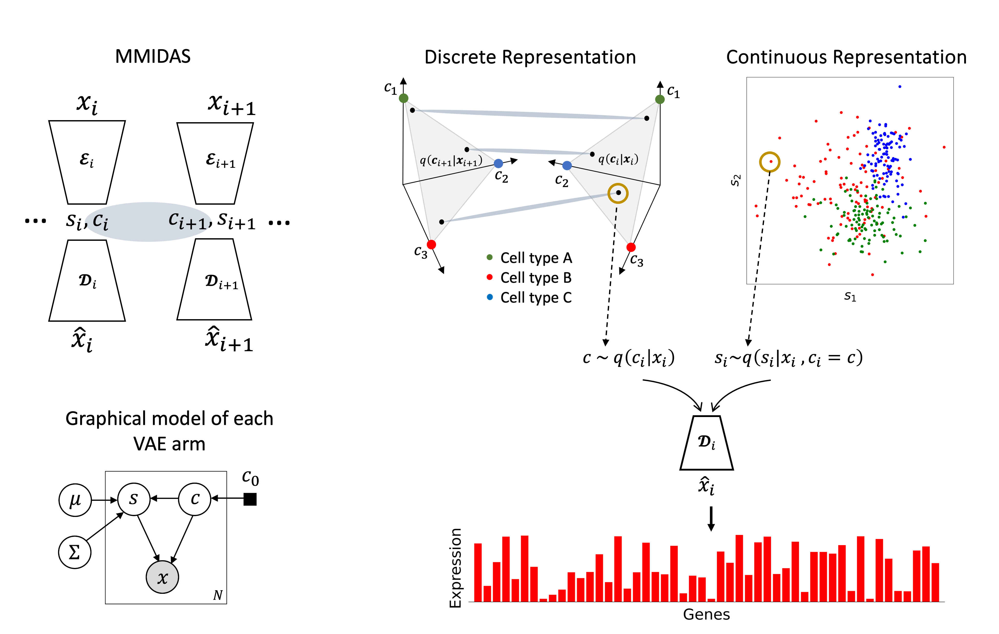

# MMIDAS (Mixture Model Inference with Discrete-coupled AutoencoderS)

Implementation of [Joint inference of discrete cell types and continuous type-specific variability in single-cell datasets with MMIDAS](https://www.biorxiv.org/content/10.1101/2023.10.02.560574v1.abstract).

A generalized and unsupervised mixture variational model with a multi-armed deep neural network, to jointly infer the discrete type and continuous type-specific variability. This framework can be applied to analysis of both, uni-modal and multi-modal datasets. It outperforms comparable models in inferring interpretable discrete and continuous representations of cellular identity, and uncovers novel biological insights. MMIDAS can thus help researchers identify more robust cell types, study cell type-dependent continuous variability, interpret such latent factors in the feature domain, and study multi-modal datasets.


## Datasets
- [Allen Institute Mouse Smart-seq dataset](https://portal.brain-map.org/atlases-and-data/rnaseq/mouse-v1-and-alm-smart-seq)
- [Allen Institute Mouse 10x isocortex dataset](https://assets.nemoarchive.org/dat-jb2f34y)
- [Allen Institute Patch-seq data](https://dandiarchive.org/dandiset/000020/)

  The electrophysiological features have been computed following the approach in [cplAE_MET/preproc/data_proc_E.py](cplAE_MET/preproc/data_proc_E.py)
- [Seattle Alzheimer’s disease dataset (SEA-AD)](https://SEA-AD.org/)

### Requirements
- Python >= 3.9
- PyTorch >= 2.0
- CUDA enabled computing device

### Installation
#### Conda environment
Creat a new conda environment and activate it.
```
conda create -n mmidas python=3.9
conda activate mmidas
```
Clone the repository and change your working directory to the newly cloned repository's path. Then install all required packages listed in the ```requirement.txt``` file.
```
cd <directory you want to place the repo>
git clone https://github.com/AllenInstitute/MMIDAS
cd MMIDAS
python -m pip install -r requirements.txt
```
#### Pytorch - CPU only
```
conda install pytorch==2.1.1 torchvision==0.16.1 torchaudio==2.1.1 cpuonly -c pytorch
```

#### Pytorch - GPU
Generally, PyTorch is compatible with NVIDIA GPUs that support CUDA, as CUDA provides the GPU acceleration process. There has been progress in making PyTorch compatible with Apple's chips, but for now the focus is on CUDA-supported NVIDIA GPUs.

Use ```nvidia-smi``` command to get the installed CUDA version.

Select the appropriate PyTorch installation from [here](https://pytorch.org/get-started/previous-versions/), matching your CUDA version.

```
# CUDA 12.1
conda install pytorch==2.1.1 torchvision==0.16.1 torchaudio==2.1.1 pytorch-cuda=12.1 -c pytorch -c nvidia
```

#### Install ```mmidas``` package
```
pip install -e .    
```

### Usage
Work through the provided notebooks in the following sequential: 

1. Data Preparation: Prepare the data file for training and testing (here for Mouse Smart-seq data)
2. Training: Once the data is ready, train a MMIDAS model with 2 mixture variational arms.
3. Evaluation: Test the trained model(s) and identify categorical variables representing cell types using the proposed pruning approach in the simplex.
4. Clusterability: Compare the accuracy and Silhouette score of identified clusters to the suggested t-type.
5. State trvaersal analysis: Explore the role of genes in encoding the continuous variability inferred by the model.
